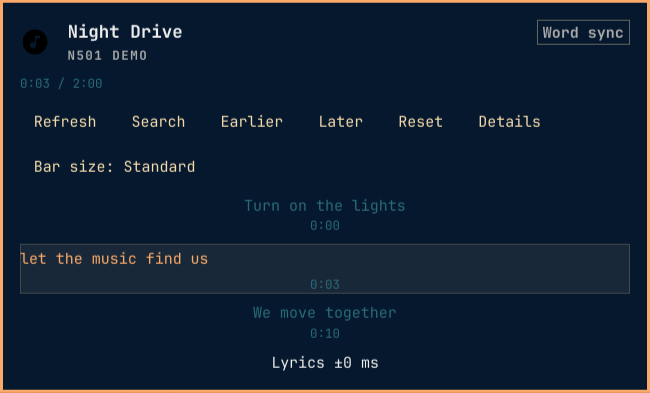

# N501 Verse

> Synchronized lyrics that stay with your music.

N501 Verse is an Omarchy bar plugin that keeps the current lyric line beside the music you are playing. It resolves lyrics locally first, works with the shared Kotonoha cache, and exposes a native panel for search, correction, and timing calibration.



Preview captured from the QML panel with synthetic demo metadata and lyrics.

## Why N501 Verse

- **Native to Omarchy** — a real bar widget and panel, not a separate overlay competing with the shell.
- **Local first** — adjacent sidecars and embedded lyrics take priority when the active player exposes a local file.
- **Offline capable** — existing shared-cache entries remain available without network requests.
- **Honest timing** — word sync is shown only when the document contains complete word spans; ordinary LRC results remain line-timed.
- **Correctable** — search one provider at a time, pin the exact result, forget it later.
- **Tunable** — adjust a document-specific timing offset without rewriting the lyric file.
- **Provider-neutral** — uses the installed Kotonoha stack instead of bundling another resolver or cache.

## Install

`omarchy plugin add` installs the plugin files. It does **not** run `install.sh` or install Kotonoha. If Kotonoha is not already importable by `/usr/bin/python3`, install it first:

```bash
omarchy pkg aur add kotonoha-git
/usr/bin/python3 -c 'import kotonoha'
```

Then add and place the widget:

```bash
omarchy plugin add https://github.com/Nombah501/n501-verse.git --enable --yes
omarchy bar put n501.karaoke --after tablet-mode
omarchy bar move n501.karaoke --section left --after tablet-mode
```

The plugin keeps the technical ID `n501.karaoke` for stable configuration while presenting the product as **N501 Verse**.

### Optional bootstrap

If you prefer a single setup command, review `install.sh` and run it explicitly:

```bash
(
  tmp="$(mktemp -d /tmp/n501-verse.XXXXXX)"
  git clone --depth 1 https://github.com/Nombah501/n501-verse.git "$tmp" && bash "$tmp/install.sh"
  status=$?
  rm -rf "$tmp"
  exit "$status"
)
```

The bootstrap:

1. checks whether `/usr/bin/python3` can import Kotonoha;
2. installs `kotonoha-git` from the AUR only when it is missing;
3. validates the import again;
4. adds or updates the git-managed plugin;
5. places it after `tablet-mode`.

It uses Omarchy commands and runs only when you invoke it. The AUR package manager may build third-party code on your system; inspect the package and script before use.

### Update or remove

```bash
omarchy plugin update n501.karaoke --yes
omarchy plugin remove n501.karaoke --yes
```

The plugin runs inside `omarchy-shell` as unsandboxed QML/Python code. Review the source before enabling it.

## Requirements

- Omarchy with third-party plugin support.
- An active media player exposed through Omarchy's selected media service.
- An AUR helper available to `omarchy pkg aur add` if Kotonoha needs installation.
- Kotonoha importable by `/usr/bin/python3` after installation.

No separate `playerctl` reader, player-specific integration, or credentials are required. Search corrections use a small plugin-owned SQLite database described below.

## Timing you can trust

N501 Verse distinguishes the document it actually received:

| Display | Meaning |
| --- | --- |
| **Word sync** | Complete word spans are available and the fill can move within a line. |
| **Line sync** | The document has line timestamps but no complete word timing. |
| **Word + line** | Some lines have complete word spans and others are line-timed. |

A provider advertising “synchronized lyrics” does not guarantee word timing. N501 Verse does not invent intra-line progress when the payload does not contain it.

## Controls

| Input | Action |
| --- | --- |
| Left click | Open or close the panel |
| Right click | Retry an error, or refresh the current document |
| Middle click | Open manual search |
| `Esc` | Close the panel |
| `Tab` / `Backtab` | Switch panel sections |
| `↑` / `↓`, `j` / `k` | Move the active cursor |
| `Enter` / `Space` | Activate the selected item |
| `f` | Toggle follow mode |
| `[` / `]` | Move lyrics earlier or later by 100 ms |
| `r` | Retry an error, or refresh ready lyrics |
| `/` | Open manual search |
| `b` | Return from search to lyrics |

## Settings

- **Bar size** — Compact, Standard, or Expanded.
- **Network** — Auto or Offline.
- **Netease** — experimental community source; word timing depends on availability.
- **LRCLIB** — free community source; ordinary results are line-timed.
- **Kugou** — experimental community source; word timing depends on availability.
- **Translations** — show or hide translated lines when supplied.
- **Motion** — animate the loading trace. Timestamp progress and synchronized word fill remain visible when motion is off.

Provider availability, timing, rights, and correctness are not guaranteed. Network and cache documents are for personal display; lyric rights remain with their respective owners.

## Privacy and storage

- Network lookups happen only in **Auto** mode.
- Local sidecars and embedded lyrics are read from the active local track; they are not sent to a network provider by the local-first path.
- The shared lyric cache and timing offsets use Kotonoha's storage. The plugin does not create a second lyrics cache.
- Search corrections are stored in `$XDG_STATE_HOME/n501.karaoke/search_aliases.sqlite3` (or `~/.local/state/n501.karaoke/search_aliases.sqlite3` when `XDG_STATE_HOME` is unset). This SQLite file holds original track metadata, the selected query, and the matched result identity; it stores no lyric bodies.
- Diagnostics use bounded machine-readable errors and do not include lyric bodies, provider payloads, cookies, or headers.

## Troubleshooting

### The widget reports a dependency error

Install Kotonoha so its modules are importable by `/usr/bin/python3`, then rescan the shell:

```bash
omarchy-shell shell rescanPlugins
```

### No lyrics appear

Check that the player exposes stable title and artist metadata. In **Auto** mode, retry after confirming the provider toggles are enabled. In **Offline** mode, only local lyrics and existing cache entries can resolve.

### The result is line-timed instead of karaoke-style

That is expected when the selected document contains line timestamps without complete word spans. Try another provider or attach a word-timed local document; the UI keeps the limitation visible instead of fabricating progress.

## Repository layout

```text
manifest.json          Plugin metadata and shell entry points
Panel.qml              Native bar widget and panel composition
Service.qml            Playback lifecycle, lookup, correction, and offset owner
KaraokeLine.qml        Current-line renderer
KaraokeModel.js        Pure lyric projection logic
bin/karaoke-lyrics     Kotonoha-backed resolver helper
```

## License

MIT. See [LICENSE](LICENSE).
