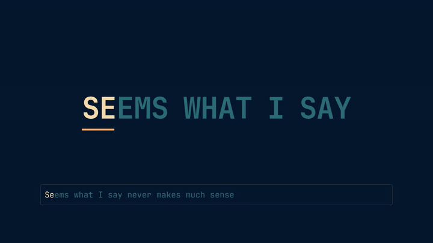

# N501 Verse

> Synchronized lyrics that stay with your music.

N501 Verse is an Omarchy bar plugin that keeps the current lyric line beside the music you are playing. It resolves lyrics locally first, keeps its own offline cache, and exposes a native panel for search, correction, and timing calibration.

## Demo

[](https://github.com/Nombah501/n501-verse/releases/download/demo-heart-on-redial/n501-verse-karaoke-demo.mp4)

The full [46-second video with sound is on the release page](https://github.com/Nombah501/n501-verse/releases/tag/demo-heart-on-redial); everything shown is real plugin rendering, word-synced to the song.


Preview captured from the QML panel with synthetic demo metadata and lyrics.

**Bar in motion:** synchronized words fill as the track plays, then the next line appears. Recorded from the QML widget with synthetic demo lyrics.


## Why N501 Verse

- **Native to Omarchy** — a real bar widget and panel, not a separate overlay competing with the shell.
- **Nothing else to install** — the lyrics resolver ships inside the plugin and runs on the system Python with no third-party packages.
- **Local first** — adjacent sidecars and embedded lyrics take priority when the active player exposes a local file.
- **Offline capable** — cached and pinned documents remain available without network requests.
- **Honest timing** — word sync is shown only when the document contains complete word spans; ordinary LRC results remain line-timed.
- **Correctable** — search one provider at a time, pin the exact result, forget it later.
- **Tunable** — adjust a document-specific timing offset without rewriting the lyric file.

## Install

```bash
omarchy plugin add https://github.com/Nombah501/n501-verse.git --enable --yes
omarchy bar move n501.karaoke --section left --index 999
```

The first command installs and enables the plugin. The second places the widget last in the left section of the bar (the index is clamped to the section length); move it anywhere you like afterwards.

The plugin keeps the technical ID `n501.karaoke` for stable configuration while presenting the product as **N501 Verse**.

### Update or remove

```bash
omarchy plugin update n501.karaoke --yes
omarchy plugin remove n501.karaoke --yes
```

Updates keep the widget where you put it.

The plugin runs inside `omarchy-shell` as unsandboxed QML/Python code. Review the source before enabling it.

## Requirements

- Omarchy with third-party plugin support.
- An active media player exposed through Omarchy's selected media service.
- The system `/usr/bin/python3`.
- Optional: `python-mutagen` to read lyrics embedded in audio tags. Sidecar `.lrc` files work without it.

No separate `playerctl` reader, player-specific integration, credentials, or other lyrics application are required.

## Timing you can trust

N501 Verse distinguishes the document it actually received:

| Display | Meaning |
| --- | --- |
| **Word sync** | Complete word spans are available and the fill can move within a line. |
| **Line sync** | The document has line timestamps but no complete word timing. |
| **Word + line** | Some lines have complete word spans and others are line-timed. |

A provider advertising “synchronized lyrics” does not guarantee word timing. N501 Verse does not invent intra-line progress when the payload does not contain it.

## Controls

| Input | Action |
| --- | --- |
| Left click | Open or close the panel |
| Right click | Retry an error, or refresh the current document |
| Middle click | Open manual search |
| `Esc` | Close the panel |
| `Tab` / `Backtab` | Switch panel sections |
| `↑` / `↓`, `j` / `k` | Move the active cursor |
| `Enter` / `Space` | Activate the selected item |
| `f` | Toggle follow mode |
| `[` / `]` | Move lyrics earlier or later by 100 ms |
| `r` | Retry an error, or refresh ready lyrics |
| `/` | Open manual search |
| `b` | Return from search to lyrics |

## Settings

- **Bar size** — Compact, Standard, or Expanded.
- **Network** — Auto or Offline.
- **Netease** — experimental community source; word timing depends on availability.
- **LRCLIB** — free community source; ordinary results are line-timed.
- **Kugou** — experimental community source; word timing depends on availability.
- **Translations** — show or hide translated lines when supplied.
- **Motion** — animate the loading trace. Timestamp progress and synchronized word fill remain visible when motion is off.

Provider availability, timing, rights, and correctness are not guaranteed. Network and cache documents are for personal display; lyric rights remain with their respective owners.

## Privacy and storage

- Network lookups happen only in **Auto** mode. LRCLIB requests identify the plugin in their `User-Agent`.
- Local sidecars and embedded lyrics are read from the active local track; they are not sent to a network provider by the local-first path.
- The lyrics cache lives in `$XDG_CACHE_HOME/n501.karaoke/lyrics.sqlite3` and timing offsets in `$XDG_STATE_HOME/n501.karaoke/track_offsets.sqlite3` (`~/.cache` and `~/.local/state` when the variables are unset). Directories are created `0700` and files `0600`.
- Search corrections are stored in `$XDG_STATE_HOME/n501.karaoke/search_aliases.sqlite3`. This SQLite file holds original track metadata, the selected query, and the matched result identity; it stores no lyric bodies.
- Diagnostics use bounded machine-readable errors and do not include lyric bodies, provider payloads, cookies, or headers.

### Coming from Kotonoha or N501 Verse 0.3

Earlier versions required Kotonoha and shared its cache. On first use, 0.4 copies your manually selected lyrics and timing offsets from Kotonoha's files once, opening them read-only; automatically found lyrics are simply resolved again. Kotonoha itself is no longer needed and its files are never modified. If that copy fails, the panel shows a one-time notice and lyrics keep working.

## Troubleshooting

### No lyrics appear

Check that the player exposes stable title and artist metadata. In **Auto** mode, retry after confirming the provider toggles are enabled. In **Offline** mode, only local lyrics and existing cache entries can resolve.

### The result is line-timed instead of karaoke-style

That is expected when the selected document contains line timestamps without complete word spans. Try another provider or attach a word-timed local document; the UI keeps the limitation visible instead of fabricating progress.

### Lyrics in audio tags are ignored

Install `python-mutagen`. The panel's **Details** view reports `embedded tags: unavailable` while it is missing.

## Repository layout

```text
manifest.json          Plugin metadata and shell entry points
Panel.qml              Native bar widget and panel composition
Service.qml            Playback lifecycle, lookup, correction, and offset owner
KaraokeLine.qml        Current-line renderer
KaraokeModel.js        Pure lyric projection logic
bin/karaoke-lyrics     Resolver helper (one JSON document per call)
lyrics_core/           Lyrics Core: providers, parsers, matching, cache, offsets
```

## Credits

The Lyrics Core is derived from [Kotonoha](https://github.com/locez/kotonoha) by Locez (MIT), at commit `175cfcc`; its license and provenance are in [`lyrics_core/`](lyrics_core/UPSTREAM.md).

Music: "Heart On Redial" by Loveshadow, featuring Mana Junkie and Airtone — https://ccmixter.org/files/Loveshadow/26157 — CC BY 3.0 (https://creativecommons.org/licenses/by/3.0/); excerpt 1:15–1:57, faded out. Video made with video-shotcraft (https://github.com/Vincentwei1021/video-shotcraft, Apache-2.0) and Remotion (https://www.remotion.dev); sound effects from the video-shotcraft asset library (Mixkit license); wallpaper from the Omarchy retro-82 theme.

CC BY 3.0 music applies only to the demo video, not to the plugin (MIT).

## License

MIT. See [LICENSE](LICENSE). The Lyrics Core keeps Kotonoha's MIT notice in [`lyrics_core/LICENSE`](lyrics_core/LICENSE).
