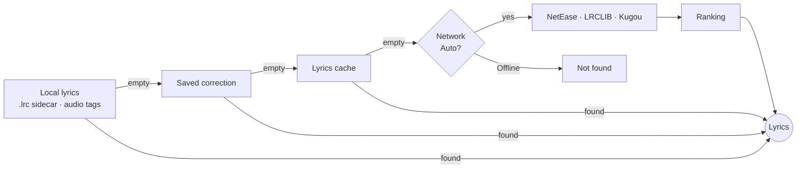
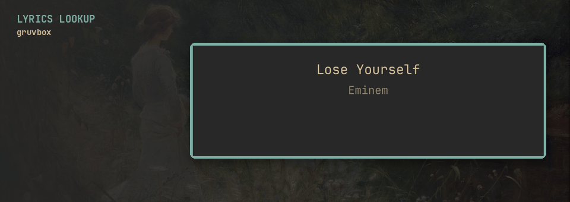
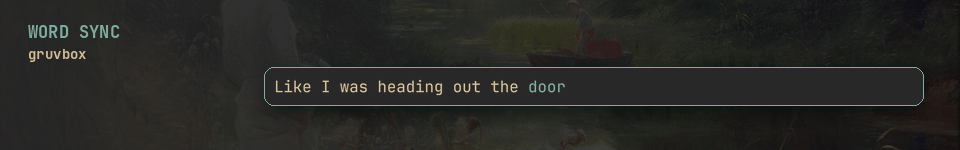
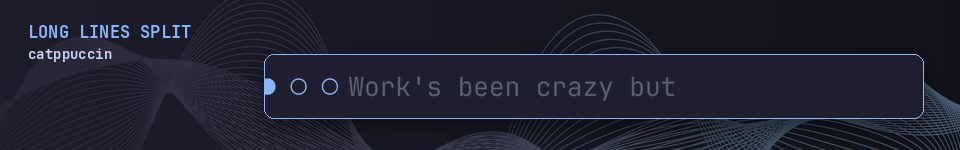
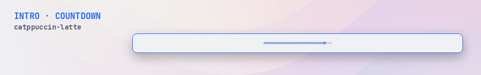
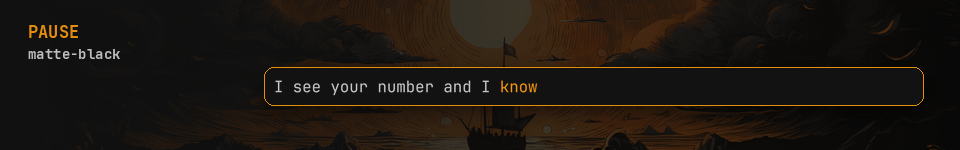
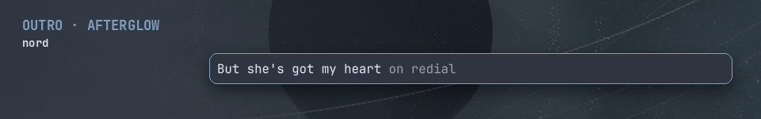
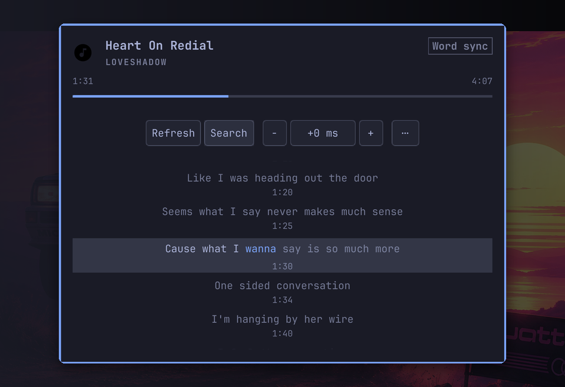

# N501 Verse

> Every word, on the beat — word-synced lyrics in your Omarchy bar.

N501 Verse fills the current lyric word by word, right in the Omarchy bar. It finds synced lyrics on its own — your local `.lrc` files first, then NetEase, LRCLIB and Kugou — follows any MPRIS player, and recolors itself with every Omarchy theme.


https://github.com/user-attachments/assets/ecb676f9-04f2-4a07-8469-97a4b4d4ffdd

Real bar renders (no mockups) cycling six stock Omarchy themes. The swatches are the three colours the plugin takes from each theme: bar background, text, and the accent for the active word.

## At a glance

- 🎤 **Word by word** — the active word fills with your theme's accent; sung words stay bright, upcoming ones dim.
- 🔎 **Finds lyrics on its own** — local `.lrc` and embedded tags first, then NetEase, LRCLIB and Kugou; each step is shown live.
- 🎨 **Every theme** — bar, panel and fill take their colours from the active Omarchy theme, light or dark.
- 🎬 **Every part of a song** — intro and interlude countdowns, pause, afterglow outro, long lines split to fit.
- 🎧 **Any MPRIS player** — whatever Omarchy's media service follows: Spotify, browsers, mpv, VLC and others.
- ✅ **Honest timing** — word sync only when the lyrics really carry word timing; otherwise it says *Line sync*.
- 📴 **Nothing else to install** — the resolver ships inside the plugin, runs on the system Python, and works offline from local files and cache.


## Install

```bash
omarchy plugin add https://github.com/Nombah501/n501-verse.git --enable --yes
omarchy bar move n501.karaoke --section left --index 999
```

The first command installs and enables the plugin. The second places the widget last in the left section of the bar (the index is clamped to the section length); move it anywhere you like afterwards.

The plugin keeps the technical ID `n501.karaoke` for stable configuration while presenting the product as **N501 Verse**.

### Update or remove

```bash
omarchy plugin update n501.karaoke --yes
omarchy plugin remove n501.karaoke --yes
```

Updates keep the widget where you put it.

The plugin runs inside `omarchy-shell` as unsandboxed QML/Python code. Review the source before enabling it.

## Requirements

- Omarchy with third-party plugin support.
- An active media player exposed through Omarchy's selected media service.
- The system `/usr/bin/python3`.
- Optional: `python-mutagen` to read lyrics embedded in audio tags. Sidecar `.lrc` files work without it.

No separate `playerctl` reader, player-specific integration, credentials, or other lyrics application are required.

## How it finds lyrics



Each step stops at the first hit. With the network on, the enabled providers are asked and their answers ranked by how well they match the track. The bar shows the current step while it works; the panel lists every source's outcome.



A real lookup of a track with no local lyrics, captured at real speed in the gruvbox theme.

Found the wrong song? Middle-click opens manual search: query one provider, pin the exact result, forget it later.

## Timing you can trust

The panel badge says which timing the lyrics actually carry:

| Badge | Meaning |
| --- | --- |
| **Word sync** | Every line has word timing; the fill moves within the line. |
| **Line sync** | Line timestamps only; the whole line lights up at once. |
| **Word + line** | Some lines have word timing, others only line timing. |

"Synchronized lyrics" from a provider does not guarantee word timing, and N501 Verse never invents it. If a track is out of step, `[` and `]` shift its lyrics by 100 ms; the offset is remembered for those lyrics.

## What the bar shows

| | |
| --- | --- |
|  | **Word sync.** The active word fills with the theme accent; sung words stay bright, upcoming words dim. A small accent mark flashes once when the first word-timed line of a track starts. |
|  | **Long lines.** A line wider than the bar is shown in parts, split at punctuation, at the longest pause between words, or at the most balanced point. The panel wraps it instead. |
|  | **Intro and interludes.** Before the first line and in gaps of 3 seconds or more, a trace runs, then a three-dot countdown with the next line shown dimmed. |
|  | **Pause.** The bar freezes at half opacity with a ⏸ mark and picks up exactly where it stopped. |
|  | **Outro.** After the last line the lyric fades into a short afterglow, then a static mark. **No lyrics or an error** settles into the same mark with a short reason. |

Clips: "Heart On Redial" (CC BY 3.0, see Credits) with a local word-timed `.lrc`, one Omarchy theme per clip.

## The panel



Left-click the widget to open it: the whole lyric sheet with the active line highlighted and filling, the timing badge, **Refresh**, **Search**, the timing offset (`−` / `+`), and **⋯** for Details, Clear cache and more. Click a line to seek there.

## Controls

| Input | Action |
| --- | --- |
| Left click | Open or close the panel |
| Right click | Retry an error, or refresh the current document |
| Middle click | Open manual search |
| `Esc` | Close the panel |
| `Tab` / `Backtab` | Switch panel sections |
| `↑` / `↓`, `j` / `k` | Move the active cursor |
| `Enter` / `Space` | Activate the selected item |
| `f` | Toggle follow mode |
| `[` / `]` | Move lyrics earlier or later by 100 ms |
| `r` | Retry an error, or refresh ready lyrics |
| `/` | Open manual search |
| `b` | Return from search to lyrics |

## Settings

- **Bar size** — Compact, Standard, or Expanded.
- **Network** — Auto or Offline.
- **Netease** — experimental community source; word timing depends on availability.
- **LRCLIB** — free community source; ordinary results are line-timed.
- **Kugou** — experimental community source; word timing depends on availability.
- **Translations** — show or hide translated lines when supplied.
- **Motion** — animate waves, the countdown, and the search shimmer. With motion off, states are shown statically; timestamp progress and word fill remain.

Provider availability, timing, rights, and correctness are not guaranteed. Network and cache documents are for personal display; lyric rights remain with their respective owners.

## Privacy and storage

- Network lookups happen only in **Auto** mode. LRCLIB requests identify the plugin in their `User-Agent`.
- Local sidecars and embedded lyrics are read from the active local track; they are not sent to a network provider by the local-first path.
- Everything the plugin writes is in three SQLite files (`~/.cache` and `~/.local/state` when `$XDG_CACHE_HOME`/`$XDG_STATE_HOME` are unset). Directories are created `0700` and files `0600`. Each file has a fixed row limit, so none of them grows without bound:

  | File | Holds | Limit |
  | --- | --- | --- |
  | `$XDG_CACHE_HOME/n501.karaoke/lyrics.sqlite3` | Lyrics found automatically and lyrics you picked by hand | 1,000 entries (about 7 KB each); the least recently used go first |
  | `$XDG_STATE_HOME/n501.karaoke/track_offsets.sqlite3` | Timing offsets | 5,000 entries; the least recently changed go first |
  | `$XDG_STATE_HOME/n501.karaoke/search_aliases.sqlite3` | Search corrections: original track metadata, the query, and the matched result identity; no lyric text | 1,000 entries; the least recently saved go first |

- **⋯ → Clear cache** in the panel removes only automatically found lyrics; they are fetched again on the next play. Lyrics you picked by hand, search corrections, and timing offsets stay. To remove everything, delete the three files above.
- Diagnostics use bounded machine-readable errors and do not include lyric bodies, provider payloads, cookies, or headers.

## Troubleshooting

### No lyrics appear

Check that the player exposes stable title and artist metadata. In **Auto** mode, retry after confirming the provider toggles are enabled. In **Offline** mode, only local lyrics and existing cache entries can resolve.

### The result is line-timed instead of karaoke-style

That is expected when the selected document contains line timestamps without complete word spans. Try another provider or attach a word-timed local document; the UI keeps the limitation visible instead of fabricating progress.

### Coming from Kotonoha or N501 Verse 0.3

Kotonoha is no longer needed: on first use, 0.4 and later copy your hand-picked lyrics and timing offsets from its files once (read-only) and resolve everything else again.

### Lyrics in audio tags are ignored

Install `python-mutagen`. The panel's **⋯ → Details** view reports `embedded tags: unavailable` while it is missing.

## Repository layout

```text
manifest.json          Plugin metadata and shell entry points
Panel.qml              Native bar widget and panel composition
Service.qml            Playback lifecycle, lookup, correction, and offset owner
KaraokeLine.qml        Current-line renderer
KaraokeModel.js        Pure lyric projection logic
bin/karaoke-lyrics     Resolver helper (one JSON document per call)
lyrics_core/           Lyrics Core: providers, parsers, matching, cache, offsets
```

## Credits

The Lyrics Core is derived from [Kotonoha](https://github.com/locez/kotonoha) by Locez (MIT), at commit `175cfcc`; its license and provenance are in [`lyrics_core/`](lyrics_core/UPSTREAM.md).

Demo media: "Heart On Redial" by Loveshadow, featuring Mana Junkie and Airtone — https://ccmixter.org/files/Loveshadow/26157 — CC BY 3.0 (https://creativecommons.org/licenses/by/3.0/). The theme GIF, the preview, the bar clips and the panel show its lyrics (0:49–3:41) as rendered by the real widget from a local word-timed `.lrc`. The lookup clip shows only a track title and the lookup steps, no lyrics. Backgrounds are the stock wallpapers of the Omarchy tokyo-night, gruvbox, catppuccin, nord, matte-black and catppuccin-latte themes.

CC BY 3.0 music and lyrics apply only to the demo media, not to the plugin (MIT).

## License

MIT. See [LICENSE](LICENSE). The Lyrics Core keeps Kotonoha's MIT notice in [`lyrics_core/LICENSE`](lyrics_core/LICENSE).
